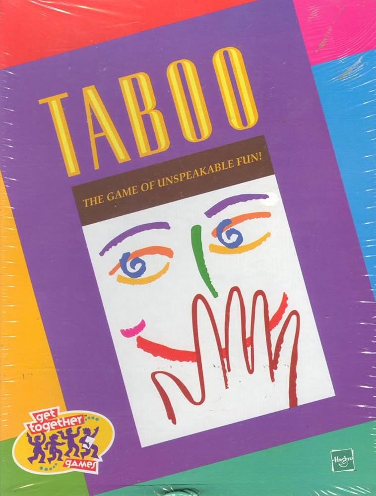

# T@b00

A real-time multiplayer word-guessing game inspired by Taboo (Parker Brothers) and Blather Round (JackBox Games). This is more party-gamesque than I'd typically like to make. But there are a lot of interesting problems here. The main one is translating typically oral interactions to written settings. The game tries to preserve a sense of urgency in messages, while simultaneously allowing players to bet on shared mental lexicons. Made for LING0130: Linguistic Principles Behind Word Games and Puzzles.



## Gameplay

The goal is to **(1) write the best clues possible** and **(2) guess the clues well**. When writing clues, you cannot use the word or related taboo words. Target gameplay: **3–5 minutes**.

**Current settings:** 4 cards per player, minimum 3 players.

### Scoring Mechanism

The game incentivizes both clue quality and fast guessing:

- **Writing good clues** → your cards get guessed faster by others
- **Fast guessing** → you earn points based on how quickly you guess words

#### Example

We might have Alice writing clues for *brush*, *license*, *shout*, *librarian*:

- "A tool for making hair look nice or a painting"
- "James Bond has a ___ to kill"
- "Using your outside voice"
- "Someone who organizes tomes for a living"

Bob guesses 2 and 4 in the first 5 seconds; Charlie guesses 1 and 3 later.

**Alice's score:**
- Card completion: 100 + 100 + 100 + 100 = **400 points**
- Time bonuses: 200 + 200 + 50 + 50 = **500 points**
- **Total: 900 points**

### Card Pool

Words sourced from the original Taboo game, spanning:
- Common nouns: *Ice*, *Flag*, *Waitress*
- Abstract concepts: *Immediately*, *Literature*, *Advice*
- Place names: *Paris, France*

**Guess phase timeout:** 1 minute

### Current Focus

Balancing clue writing vs. guessing difficulty and conducting playtests.

Rest of this README is generated by Claude.


## Stack

- **Backend**: Flask + Flask-SocketIO (WebSockets via eventlet)
- **Frontend**: Svelte 5 + Vite
- **Data**: Taboo cards loaded from `data/taboo_cards.csv`

## Setup

### Prerequisites

- Python 3.9+
- Node.js 18+

### Server

```bash
cd server
pip install -r requirements.txt
python app.py
```

Runs on `http://localhost:5001`.

### Frontend

```bash
cd frontend && npm install
npm run dev
```

Runs on `http://localhost:5173` (proxies WebSocket to the server).

## Configuration

Edit `server/config.py`:

| Setting | Default | Description |
|---------|---------|-------------|
| `CARDS_PER_PLAYER` | 4 | Cards dealt to each player |
| `MAX_PLAYERS_PER_ROOM` | 50 | Max players per lobby |
| `DEBUG_MODE` | True | Allows single-player testing (game ends without needing own cards guessed) |

## Bots

The lobby leader can add 1–5 bots for testing. Bots auto-submit clues (the answer word itself) so you can play through a full game solo.

## Deploying

Build the frontend and serve from Flask on a single host:

```bash
cd frontend && npm run build
```

Then serve `frontend/dist/` as static files from Flask and run `python server/app.py` on your server (EC2, Railway, Render, etc.). WebSocket support is required — platforms like Vercel/Netlify won't work for the backend.

## Project Structure

```
taboo/
  data/
    taboo_cards.csv       # Card definitions (word + taboo words)
    bot_clues.csv         # Bot clue lookup (unused at runtime, kept for reference)
  server/
    app.py                # Flask app entry point
    config.py             # Game settings
    events.py             # SocketIO event handlers
    rooms.py              # Room/player/scoring logic
    cards.py              # CSV card loader
    names.py              # Random name generator
  frontend/
    src/
      App.svelte          # Screen router
      stores/gameStore.js # Svelte stores + socket actions
      components/
        Landing.svelte    # Title screen
        Lobby.svelte      # Room lobby (name editing, bot selector)
        CluePhase.svelte  # Write clues for your cards
        GuessPhase.svelte # Guess others' clues + game over modal
```
